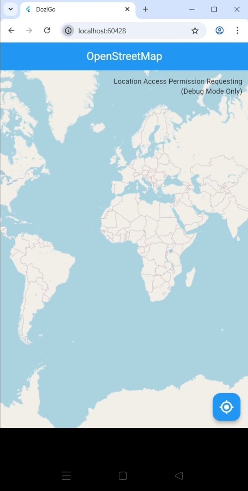
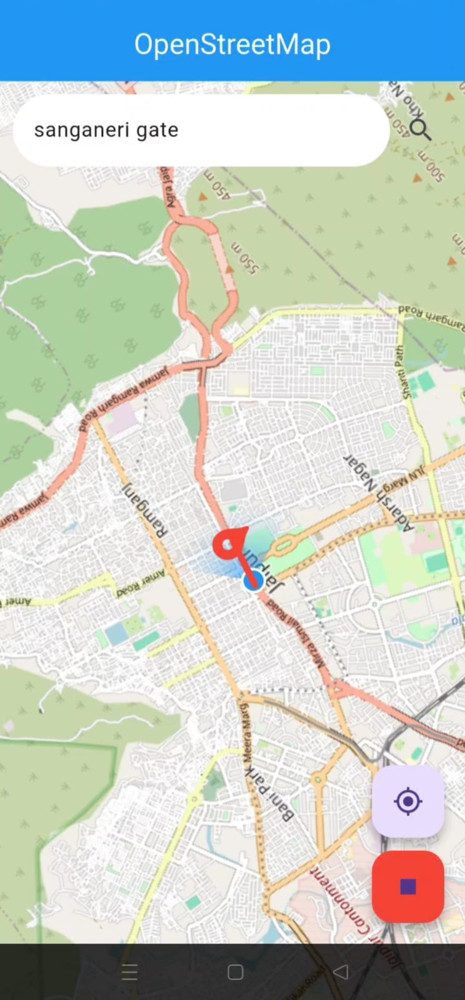

# 🚀 DozyGo – Nap Smart, Arrive Right!
## 📸 Screenshots
| Map View | Location Search |
|----------|-----------------|
|  |  |

Hey there, sleepy traveler! 😴✨ Welcome to **DozyGo**, the Flutter-powered location alarm that lets you **doze off peacefully** while we keep an eye on your destination. No more missing your stop or awkwardly waking up at the end of the line! 🚌🚆

> *"Relax – Doze – Arrive Right"* 🎯

## ✨ Features That'll Make You Smile
- **🗺️ Live OpenStreetMap**: Beautiful, real-time maps powered by OpenStreetMap. No Google API keys needed – we're open-source friendly! 🌍
- **📍 GPS Tracking**: Your location updates live every 2 seconds. We know exactly where you are (in a non-creepy way 😅).
- **🔍 Smart Search**: Type any destination and Nominatim finds it for you. Cities, landmarks, that random bus stop – we got you!
- **📏 Distance Alarm**: Set your wake-up distance – **200m, 500m, or 1km** before arrival. Your nap, your rules! ⏰
- **🔔 Custom Alarm Sound**: A cheerful *children.mp3* wakes you up gently (or annoyingly – however you interpret it 😂).
- **🛣️ Route Visualization**: See your entire path with a slick red polyline. Know where you're headed!
- **🎯 One-Tap Current Location**: Lost? Hit the target button and zoom right back to yourself.
- **🛑 Stop Alarm Anytime**: Red floating button = instant peace. Silence is one tap away.
- **⚡ Real-Time Distance Check**: Background timer checks your proximity every 2 seconds. We never sleep so you can! 💤

## 🛠️ Tech Stack


**Key Packages:**
- `flutter_map` – Open-source maps without the Google tax 💸
- `location` + `geolocator` – Precision GPS tracking
- `flutter_map_location_marker` – That cool blue dot showing where you are
- `audioplayers` – Alarm sound magic 🔊
- `flutter_polyline_points` – Decoding those twisty route lines
- `http` – Talking to Nominatim & OSRM APIs

## 🎮 Quick Start
1. Clone the repo: `git clone <your-repo-url>`
2. Flutter setup: `flutter pub get`
3. Make sure you've got **location permissions** enabled on your device!
4. Fire it up: `flutter run`
5. Search your destination → pick alarm distance → **doze off** 😴
6. Wake up exactly when you need to! 🎉

> **Pro Tip:** Works best on real devices – emulators fake locations and that's no fun for napping! 📱

## 📸 Screenshots
| Map View | Location Search |
|----------|-----------------|
|  |  |

## 🧠 How It Works
```
1. Open App → Map zooms to your live location
2. Search Destination → Nominatim finds it
3. Pick Distance → 200m / 500m / 1km
4. Start Journey → Route appears, timer begins
5. Doze Off 😴 → We watch the distance
6. Near Destination? → ALARM! 🔊
7. Wake up → Stop alarm → Arrive right! ✅
```

## 🤝 Contributing
Love it? Fork it, tweak it, PR it! Ideas for:
- 🌙 Dark mode for night travelers
- 🎵 Custom alarm sounds
- 📊 Trip history
- ☁️ Cloud sync for favorite destinations

Open an issue – let's make DozyGo epic! 💪

## 📄 License
MIT – use it, love it, share it!

## 👨‍💻 Author
Built with ❤️ by Tanmay Chhipa. Star ⭐ if it sparks joy!

---

*Made with Flutter & OpenStreetMap – because missing your stop is so 2010s.* 😎🗺️

